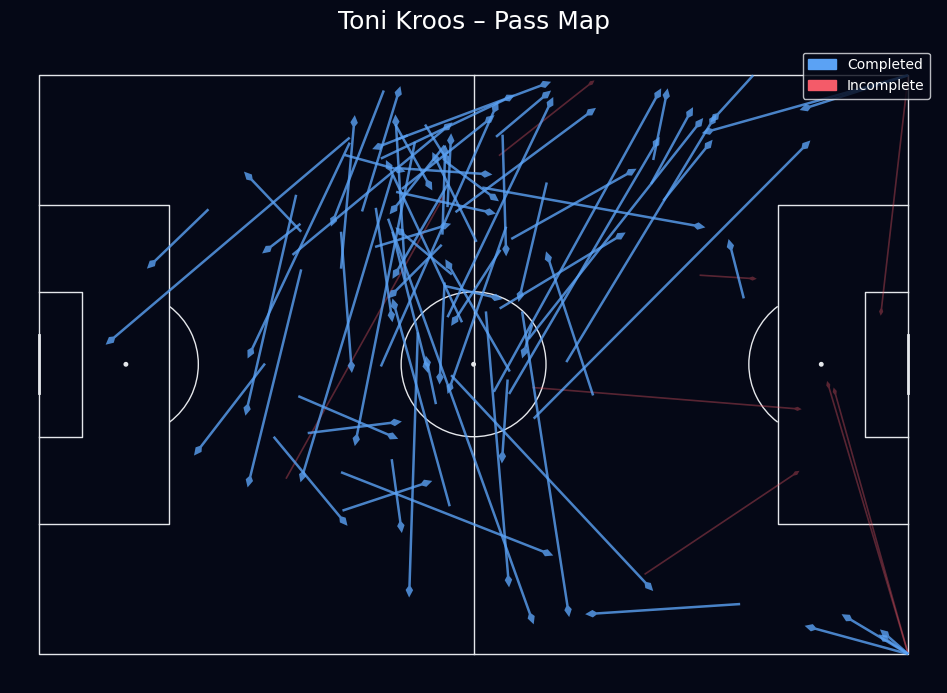

# StatsBomb Passing Network Analysis using Python

This project analyzes team passing structure using StatsBomb open event data and Python.

It builds a passing network for the match:

**Real Madrid vs Liverpool FC**  
**UEFA Champions League Final 2017/18**

The goal is to identify key distribution hubs, player connectivity, and structural patterns in team build-up play using event-level football data.

Passing network analysis is widely used in professional football to support:

- Recruitment analysis  
- Tactical analysis  
- Opposition analysis  
- Performance evaluation  

---

## Project Overview

This project transforms individual pass events into a network representation where:

- Nodes represent players
- Node size reflects passing involvement
- Edges represent connections between players
- Edge thickness reflects pass frequency

This makes it possible to visually identify:

- Key playmakers and distribution hubs
- Structural dependencies in possession
- Team build-up patterns
- Connectivity between defensive, midfield, and attacking units

---

## Example Output

### Team Passing Network


### Player Pass Map (Example: Toni Kroos)



---

## Data Source

StatsBomb Open Data

https://github.com/statsbomb/open-data

StatsBomb provides free event-level football data for educational and research purposes.

---

## Tech Stack

- Python
- pandas
- mplsoccer
- matplotlib
- StatsBomb open data

---

## Project Structure

```
statsbomb-passing-network-analysis/
│
├── passing_network.ipynb # Team passing network analysis (Example: Real Madrid)
├── pass_map.ipynb # Individual player pass map (Example: Toni Kroos, Real Madrid)
├── requirements.txt # Python dependencies
├── README.md # Project documentation
│
├── images/
│ ├── passing_network.png # Network visualization output
│ └── pass_map.png # Pass map visualization output
│
└── report/
└── passing-network-analysis-statsbomb-report.pdf # Detailed project report
```


---

## Key Insights

The analysis highlights:

- Central defenders and midfielders as primary distribution hubs
- Structural asymmetries in team build-up
- Player connectivity patterns in possession
- Tactical structure based on passing relationships

These insights can support scouting, tactical preparation, and performance analysis workflows.

---

## Report

A detailed methodological explanation and interpretation is available in the project report:

[Passing Network Analysis Report](report/passing-network-analysis-statsbomb-report.pdf)

The report explains the data processing workflow, network construction methodology, and interpretation of structural patterns in team build-up.

---

## Purpose

This project is part of my portfolio in football data science as part of my MSc in Artificial Intelligence Applied to Sports.

It demonstrates practical application of event data analysis and football network visualization using Python.

---

## Author

Moritz Philipp Haaf, BSc MA

Football Data Science | MSc AI Applied to Sports  

LinkedIn: https://www.linkedin.com/in/moritz-philipp-haaf/

GitHub: https://github.com/itzmore-mph

